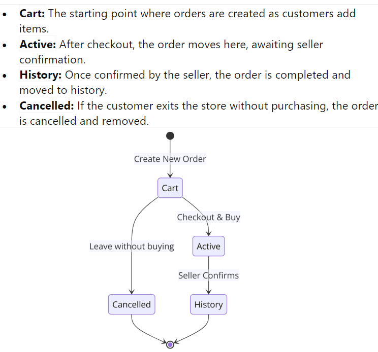
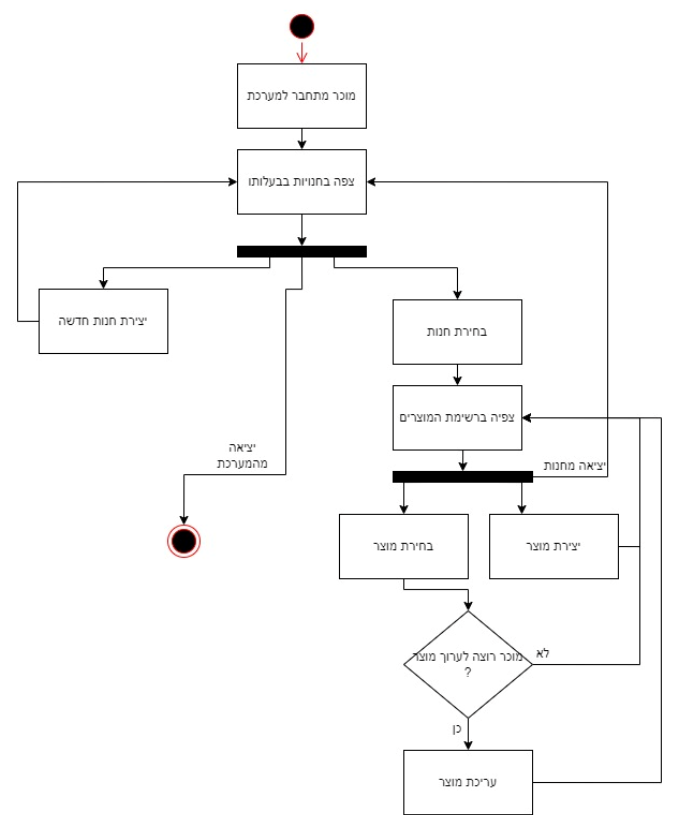
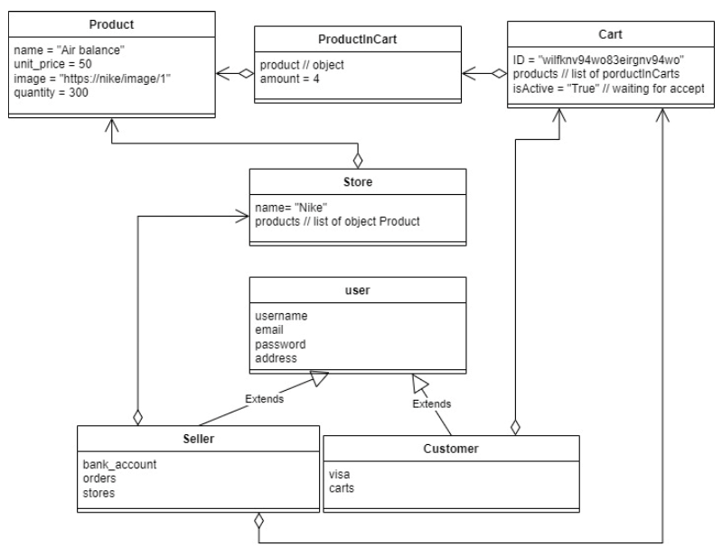

# Buy&Bye-Bye

[Authors](#authors)

[About the project](#about-the-project)

[The App](#the-app)
* [Who is it for](#who-is-it-for)
* [How to use](#how-to-use)

[The planning](#the-planning)
* [The Initiation Document](#the-initiation-document)
* [The Requierment Document](#the-requirements-document)
* [Charts](#charts)
* [App prototype sketch](#app-prototype-sketch)
* [Database](#databse)

[The implementation](#the-implementation)
* [Architectural patterns](#architectural-patterns)
* [Working with Git](#working-with-git)
* [Languages & Tools](#languages--tools)

## Authors
- Sari Saif (Team Leader): <a href="https://github.com/Sari-Saif">GitHub</a>, <a href="https://www.linkedin.com/in/sari-saif-b4872a16b/">LinkedIn</a>.
- Simcha Teich: <a href="https://github.com/SimchaTeich">Github</a>, <a href="https://www.linkedin.com/in/simcha-teich/">LinkedIn<a/>.
- Yoad Tamar: <a href="https://github.com/YoadTamar">Github</a>, <a href="http://www.linkedin.com/in/yoad-tamar-73562a2b4">LinkedIn</a>.
- Lior Vinman: <a href="https://github.com/liorvi35">Github</a>, <a href="https://www.linkedin.com/in/liorvinman/">LinkedIn</a>.

## About the project
This is the final project in the "Software Engineering" course at Ariel University. In this course we have learned about how a software development life cycle (SDLC) is conducted with CI/CD pipelines. Starting from the initiation at the developer's IDE to the production at the custormer enviroment. Throughout the course we have implemented an application for Android (using Android Studio) based phones which is a kind of illustration of the process of working on projects in the real industry world. The application we chose is an information system that manages stores, sellers, buyers, orders and everything related to them.

## The App

<div align="center"></div>

### Who is it for
The application is intended for anyone interested in buying or selling something.<br/>
Got a toy you're too sorry to throw away?<br/>
Are you the owner of a neighborhood grocery store and want to expand in Mobile?<br/>
Do you want to buy something without leaving the house?<br/>

If you answered yes to any of these questions - this app is just for you!

### How to use
The application is intended for two types of users - sellers and buyers.<br/>
Each seller can have as many stores as he wants, and each store will have any products he chooses.<br/>
With the customers, each customer can shop at any store, order products and wait for the order to be confirmed.<br/>
When the seller approves an order - it makes its way to the customer!

* Click [here](https://github.com/Sari-Saif/Buy-bye-bye/blob/main/videos/buyer.mp4) to learn how to use the app as a Buyer.
* Click [here](https://github.com/Sari-Saif/Buy-bye-bye/blob/main/videos/seller.mp4) to learn how to use the app as a Seller.

## The planning
The planning of the application and the methods of our work that were carried out throughout the semester, described here.

### The Initiation Document
In this document we were asked to design the purpose of the application, and to characterize two main processes for each type of user. After discussion, the following requirements were decided:
  * Buyer
    * will be able to buy a product (choose a store -> choose a product -> add to basket -> make a purchase)
    * will be able to rate a store (after the purchase is compleate -> rating)

* Seller
    * will be able to sell a product (creating a store -> creating a product)
    * will be able to confirm and manage orders (login to profile -> view pending orders -> select an order -> confirm the order)

Click [here](./submissions/task1.pdf) to view the **Initiation Document**

### The Requirements document
After the initiation phase, we had to break down the requirements and break them down into achievable sub-requirements according to the SMART model.

<div align="center"></div>

The requirements are divided into two types:
* functional
* non-functional.

Each of the requirements has its type, and its subtype specified.

Click [here](./submissions/task2.pdf) to view the **Requirements Document**

### Charts
This assignment was the last for the semester.<br/>
It contains seven planning charts that we used during the work.

#### ERD
<div align="center"></div>

#### State Machine Diagram
<div align="center"></div>

#### Use Case Diagram
<div align="center"></div>

#### Activity Diagram
<div align="center"></div>

#### Class Diagram
<div align="center"></div>

#### Object Diagram
<div align="center"></div>

#### Sequence Diagram
<div align="center"></div>

<br/>

Click [here](./submissions/task3.pdf) to view the **Charts Document**

### App prototype sketch
In addition to the above diagrams, we prepared a general diagram simulating the pages in the application. Using this diagram we could easily navigate during the work and understand "where we are". This diagram is also the (important) explanation for the names we gave to the windows in the code.

<div align="center"></div>

Click [here](https://app.diagrams.net/#G10Ej_V39katLq-yU0P34w2P1Stv7QUacc) to view the chart in more depth.

### Database
We decided to use Firebase real time database (RTDB) for the application.<br/>
Below is the structure of the database:

```json 
{
    "Orders": {
        "Active": {
            "OrderID1": {
                "CustomerName": "Example Customer",
                "OrderDetails": {
                    "ProductID": "12345",
                    "Quantity": 2,
                    "Price": 100
                },
                "StoreName": "TestStore"
            }
        },
        "History": {
            "OrderID2": {
                "CustomerName": "Another Example",
                "OrderDetails": {
                    "ProductID": "67890",
                    "Quantity": 1,
                    "Price": 50
                },
                "StoreName": "WeaponsForYou"
            }
        }
    },
    "Stores": {
        "TestStore": {
            "OwnerID": "Owner123",
            "Products": {
                "ProductID1": {
                    "Name": "Example Product",
                    "Price": 100,
                    "Quantity": 10,
                    "ImageURL": "http://example.com/image1.jpg"
                }
            },
            "StoreName": "TestStore",
            "SumRatings": 4.5,
            "TotalRaters": 2
        },
        "WeaponsForYou": {
            "OwnerID": "Owner456",
            "Products": {
                "ProductID2": {
                    "Name": "Weapon Example",
                    "Price": 150,
                    "Quantity": 5,
                    "ImageURL": "http://example.com/image2.jpg"
                }
            },
            "StoreName": "WeaponsForYou",
            "SumRatings": 4.7,
            "TotalRaters": 10
        }
    },
    "Users": {
        "Buyers": {
            "UserID1": {
                "Name": "Example Buyer",
                "Email": "buyer@example.com",
                "Address": "123 Example St, City",
                "Preferences": "Gaming, Outdoors"
            }
        },
        "Sellers": {
            "UserID2": {
                "Name": "Example Seller",
                "Email": "seller@example.com",
                "StoreOwned": "TestStore",
                "Ratings": 4.5
            }
        }
    }
}
```

## The implementation
The implementation process was using the **Agile** style and techniques.<br />
We started implementing the high requirements in the code, like everything needed for the buying process.<br/>
After that we added the other requirements such as store rating, search, editing (of personal details, product details, etc.).<br/>
At the end we also added UI/UX design and human engineering elements.

### Architectural patterns
Our project is built as **MVVM**. The reason is that we worked with Android Studio, and it enables this relatively easily - every UI element (i.e., a layout) to be an object (i.e, a Java class), which makes the business extremely easy.

### Working with Git
Working with Git was very convenient. At the beginning of the work when all the windows were not yet linked, we worked in separate customer and seller branches. After they have been merged (PR), each new feature was created in a new branch and only after it has been tested on the local repository, it was merged into the master branch.

<div align="center"></div>

### Languages & tools

<div align="center">
 <code></code>
 <code></code>
 <code></code>
 <code></code>
 <code></code> 
 </div>
