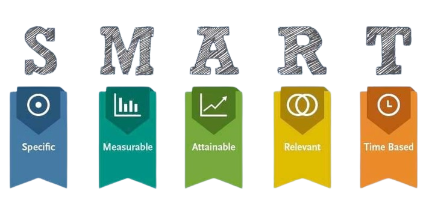
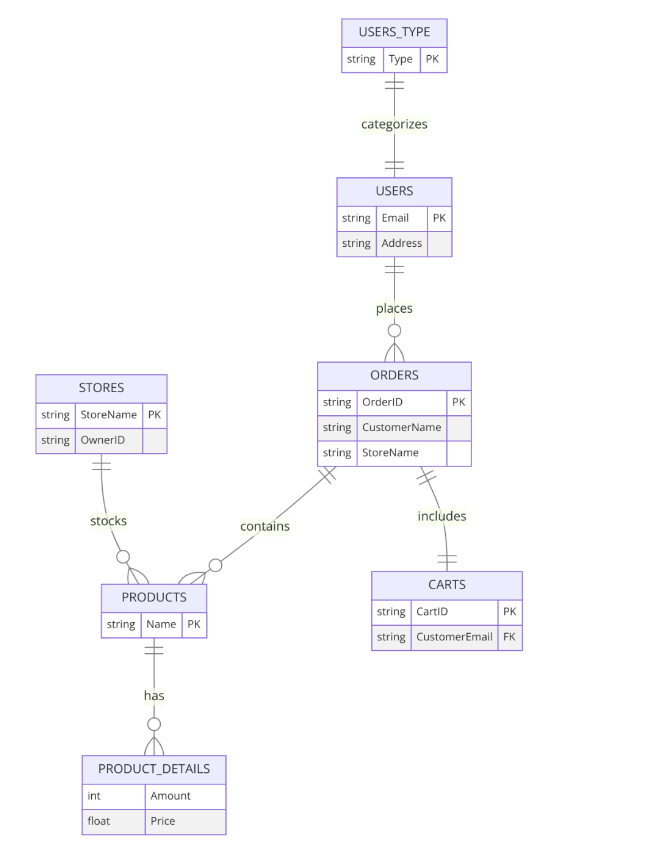
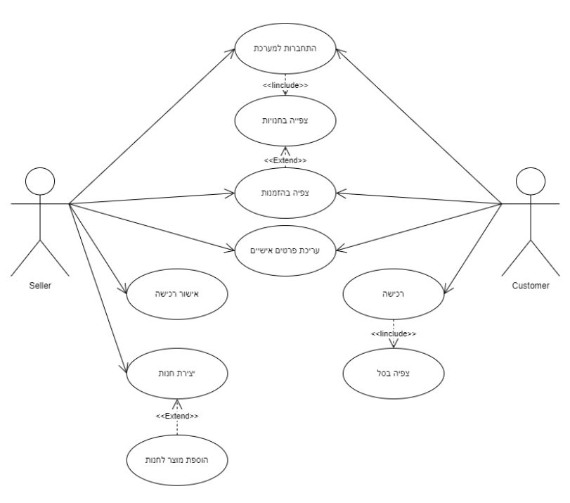
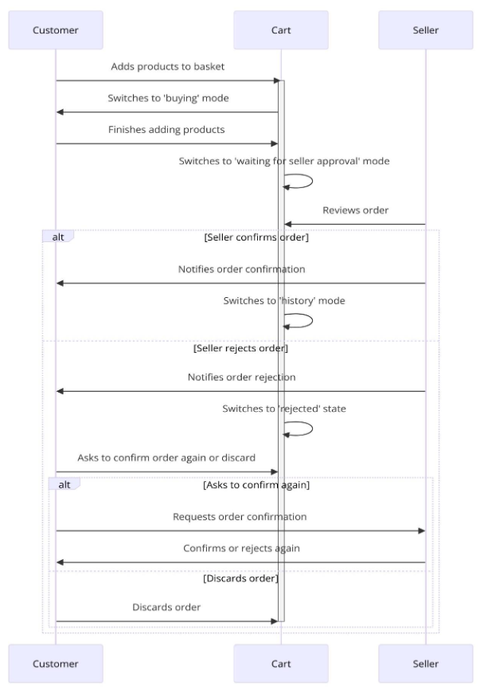
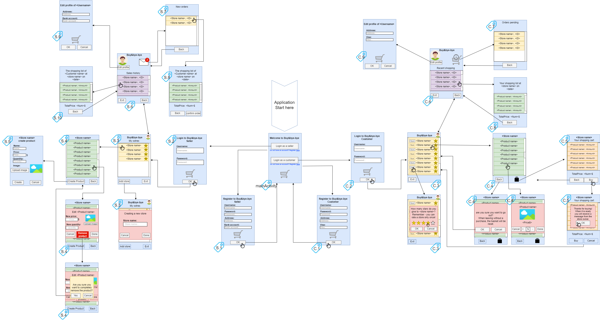
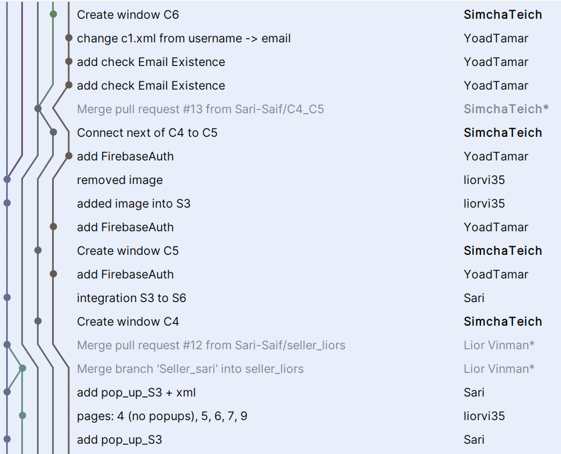

# Buy&Bye-Bye

[Authors](#authors)

[About the project](#about-the-project)

[The App](#the-app)
* [Who is it for](#who-is-it-for)
* [How to use](#how-to-use)

[The planning](#the-planning)
* [The Initiation Document](#the-initiation-document)
* [The Requierment Document](#the-requirements-document)
* [Charts](#charts)
* [App prototype sketch](#app-prototype-sketch)
* [Database](#databse)

[The implementation](#the-implementation)
* [Architectural patterns](#architectural-patterns)
* [Working with Git](#working-with-git)
* [Languages & Tools](#languages--tools)

## Author
- [@Sari Saif](https://github.com/Sari-Saif) - Team Leader.
- [@Simcha Teich](https://github.com/SimchaTeich)
- [@Yoad Tamar](https://github.com/YoadTamar)
- [@Lior Vinman](https://github.com/liorvi35)

## About the project
This is the final project in the software engineering course. In the course we learned how a software life cycle is conducted, starting from the initiation to the production. Throughout the course we implemented an application for Android which is a kind of illustration of the process of working on projects in the real world. The application we chose is an information system that manages stores, sellers, buyers, orders and everything related to them.

## The App

### Who is it for
The application is intended for anyone interested in buying or selling something. 
Got a toy you're too sorry to throw away? 
Are you the owner of a neighborhood grocery store and want to expand in Mobile? 
Do you want to buy something without leaving the house? 

If you answered yes to any of these questions - the app is for you!

### How to use
The application is intended for two types of users - sellers and buyers. 
Each seller can have as many stores as he wants, and each store will have any products he chooses. 
With the customers, each customer can shop at any store, order products and wait for the order to be confirmed. 
When the seller approves an order - it makes its way to the customer!

* Click [here](https://link_to_video) to learn how to use the app as a Buyer.
* Click [here](https://link_to_video) to learn how to use the app as a Seller.

## The planning
The planning of the application and the method of work described here were carried out throughout the semester.

### The Initiation Document
In this document we were asked to design the purpose of the application, and to characterize two main processes for each type of user. After discussion, the following requirements were decided:
  * Buyer
    * will be able to buy a product (choose a store -> choose a product -> add to basket -> payment)
    * will be able to rate a store (selection of a store -> rating)

* Seller
    * will be able to sell a product (creating a store -> creating a product)
    * will be able to confirm and manage orders (login to profile -> view pending orders -> select an order -> confirm the order)

Click [here](./submissions/task1.pdf) to view the **Initiation Document**

### The Requirements document
After the initiation phase, we had to break down the requirements and break them down into achievable sub-requirements according to the SMART model.

The requirements are divided into two types:
* functional
* non-functional.

Each of the requirements has its type, and its subtype specified.

Click [here](./submissions/task2.pdf) to view the **Requirements Document**

### Charts
This assignment was the last for the semester. 
It contains seven planning charts that we used during the work.

#### ERD

#### State Machine Diagram

#### Use Case Diagram

#### Activity Diagram

#### Class Diagram

#### Object Diagram

#### Sequence Diagram

 

Click [here](./submissions/task3.pdf) to view the **Charts Document**

### App prototype sketch
In addition to the above diagrams, we prepared a general diagram simulating the pages in the application. Using this diagram we could easily navigate during the work and understand "where we are". This diagram is also the explanation for the names we gave to the windows in the code.

Click [here](https://app.diagrams.net/#G10Ej_V39katLq-yU0P34w2P1Stv7QUacc) to view the chart in more depth.

### Databse
We decided to use firebase real time database for the application. 
Below is the structure of the database:

## The implementation
The implementation process was **Agile** style. 
We started implementing the high requirements in the code, like everything needed for the buying process. 
After that we added the other requirements such as store rating, search, editing (of personal details, product details, etc.). 
At the end we also added UI/UX design.

### Architectural patterns
Our project is built as **MVVM**. The reason is that we worked with visual studio, and it enables this relatively easily (every UI element to be an object, which makes the business extremely easy).

### Working with Git
Working with Git was very convenient. At the beginning of the work when all the windows were not yet linked, we worked in separate customer and seller branches. After they have been merged, each new feature is created in a new branch and only after it has been tested is it merged into main.

### Languages & tools

 <code></code>
 <code></code>
 <code></code>
 <code></code>
 <code></code> 
 

